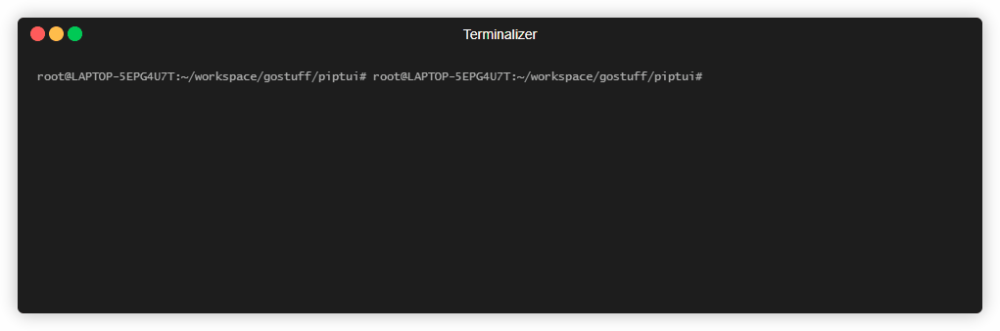

# piptui -> WORK IN PROGRESS

## How to run

- Install [go](https://go.dev/doc/install)
- Go to the project root and run `go run main.go` 

## Supported platforms

- Currently this tool is tested only on `linux` with `bash` (yes, it requires bash!)

## How to use

- go to the project root
- activate your python virtual environment
- on the same terminal session run `go run main.go`
- once the ui loads following short cuts can be used to go into different screens from the main menu (short cuts to different screens will only work from the main menu for now)
  - `ctrl+I` -> Install screen
  - `ctrl+T` -> Dependency Tree
  - `ctrl+U` -> Uninstall screen
  - `ctrl+D` -> Switch tabs (if there are multiple tabs)
  - `Esc` -> go back to the main screen

  